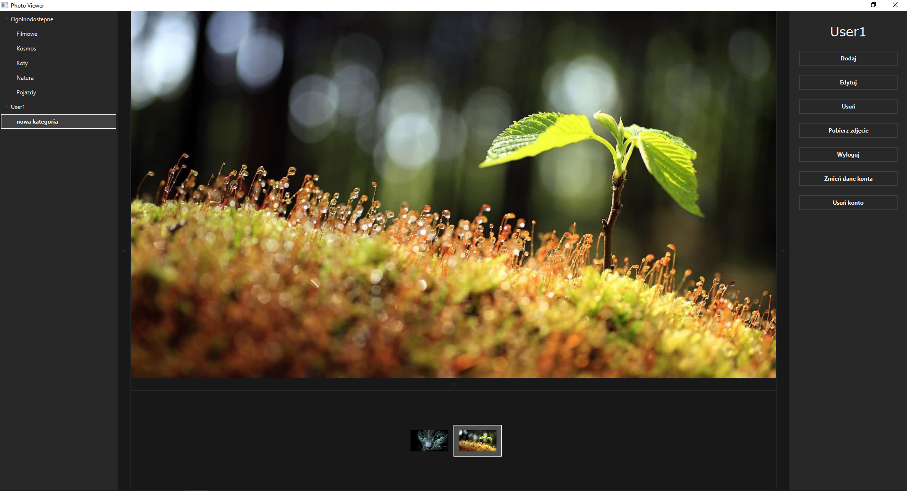

# photo_viewer
> The application allows you to view photos posted on the [server](https://github.com/GITjest/photo_viewer_server). After logging in, it allows you to add, edit and delete content, it also allows you to download photos from the server.

## Table of contents
* [Screenshots](#screenshots)
* [Technologies](#technologies)
* [Setup](#setup)
* [Features](#features)

## Screenshots



## Technologies
* JavaFX
* Java 8

## Setup
To run this project you need [photo_viewer_server](https://github.com/GITjest/photo_viewer_server).

```
# Clone this repository
git clone https://github.com/GITjest/photo_viewer

# Using your IDE
```

## Features
* Viewing photos
* Add, edit and delete categories and photos
* Registration and login users
* Downloading photos
